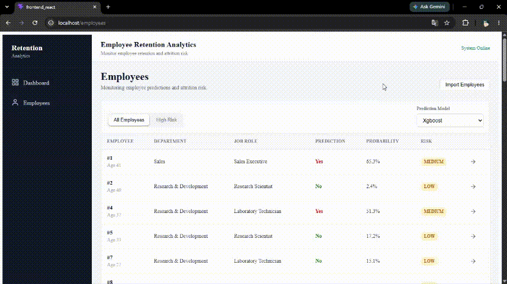

# Employee Retention Analytics System

Aplikasi web analitik retensi karyawan yang memanfaatkan machine learning untuk memprediksi risiko attrition serta menyediakan dashboard interaktif untuk membantu menganalisis kondisi retensi karyawan.

Sistem ini mengintegrasikan **React**, **Flask**, **PostgreSQL**, dan tiga algoritma machine learning untuk menghasilkan prediksi pada tingkat karyawan serta analisis risiko secara agregat.

---

## Fitur Utama

* Dashboard analitik retensi karyawan
* Pemilihan model machine learning
* Distribusi risiko attrition
* Analisis risiko berdasarkan departemen
* Analisis risiko berdasarkan job role
* Tabel prediksi karyawan dengan pagination
* Detail karyawan dan hasil prediksi
* Identifikasi karyawan berisiko tinggi
* Import data karyawan melalui CSV, XLS, dan XLSX
* Deteksi data karyawan duplikat
* Inisialisasi database secara otomatis
* Antarmuka responsif untuk desktop, tablet, dan mobile
* Deployment menggunakan Docker

---

## Dashboard

Dashboard menyediakan ringkasan kondisi retensi karyawan berdasarkan hasil prediksi model machine learning.

Pengguna dapat memilih salah satu dari tiga model:

* Logistic Regression
* Random Forest
* XGBoost

Dashboard menampilkan:

* Total karyawan
* Prediksi attrition dan retention
* Jumlah karyawan dengan risiko tinggi, sedang, dan rendah
* Distribusi tingkat risiko
* Analisis risiko berdasarkan departemen
* Analisis risiko berdasarkan job role


---

## Employee Management

Halaman Employee digunakan untuk melihat hasil prediksi pada masing-masing karyawan.

Fitur yang tersedia meliputi:

* Melihat daftar hasil prediksi karyawan
* Melihat probabilitas prediksi
* Melihat tingkat risiko
* Melihat karyawan dengan risiko tinggi
* Pagination data
* Melihat detail karyawan
* Membandingkan hasil prediksi dari ketiga model


---

## Import Data Karyawan

Sistem menyediakan mekanisme import data karyawan melalui file CSV, XLS, atau XLSX.

Data yang memiliki `EmployeeNumber` yang sudah terdaftar tidak akan dimasukkan kembali ke database.

Hasil proses import memberikan informasi:

* Jumlah data berhasil dimasukkan
* Jumlah data yang dilewati
* Daftar `EmployeeNumber` duplikat
* Status dan pesan proses



---

## Dataset

Dataset berisi informasi mengenai karakteristik demografis, pekerjaan, kompensasi, kepuasan kerja, serta riwayat karier karyawan.

Contoh struktur data:

```csv
Age,BusinessTravel,DailyRate,Department,DistanceFromHome,Education,EducationField,EmployeeCount,EmployeeNumber,EnvironmentSatisfaction,Gender,HourlyRate,JobInvolvement,JobLevel,JobRole,JobSatisfaction,MaritalStatus,MonthlyIncome,MonthlyRate,NumCompaniesWorked,Over18,OverTime,PercentSalaryHike,PerformanceRating,RelationshipSatisfaction,StandardHours,StockOptionLevel,TotalWorkingYears,TrainingTimesLastYear,WorkLifeBalance,YearsAtCompany,YearsInCurrentRole,YearsSinceLastPromotion,YearsWithCurrManager
41,Travel_Rarely,1102,Sales,1,2,Life Sciences,1,1,2,Female,94,3,2,Sales Executive,4,Single,5993,19479,8,Y,Yes,11,3,1,80,0,8,0,1,6,4,0,5
49,Travel_Frequently,279,Research & Development,8,1,Life Sciences,1,2,3,Male,61,2,2,Research Scientist,2,Married,5130,24907,1,Y,No,23,4,4,80,1,10,3,3,10,7,1,7
37,Travel_Rarely,1373,Research & Development,2,2,Other,1,4,4,Male,92,2,1,Laboratory Technician,3,Single,2090,2396,6,Y,Yes,15,3,2,80,0,7,3,3,0,0,0,0
```

Target yang digunakan dalam proses pelatihan model adalah **Attrition**.

---

## Dataset Features

Dataset awal terdiri dari **35 fitur**, yang mencakup informasi demografis, pekerjaan, kompensasi, kepuasan, serta riwayat karier karyawan.

Tidak seluruh fitur digunakan dalam proses pelatihan karena beberapa fitur tidak memberikan informasi prediktif yang relevan terhadap attrition.

---

## Feature Selection

Sebanyak **29 fitur** digunakan sebagai input untuk ketiga model machine learning.

Fitur yang digunakan:

```text
Age
DailyRate
HourlyRate
MonthlyRate
BusinessTravel
Department
DistanceFromHome
Education
EducationField
EnvironmentSatisfaction
JobInvolvement
JobLevel
JobRole
JobSatisfaction
MonthlyIncome
NumCompaniesWorked
OverTime
PercentSalaryHike
PerformanceRating
RelationshipSatisfaction
StockOptionLevel
TotalWorkingYears
TrainingTimesLastYear
WorkLifeBalance
YearsAtCompany
YearsInCurrentRole
YearsSinceLastPromotion
YearsWithCurrManager
```

Pemilihan fitur berfokus pada faktor yang secara logis berkaitan dengan attrition, seperti **demografi, kompensasi, kepuasan kerja, lingkungan kerja, beban kerja, serta perkembangan dan pengalaman karier**.

Fitur `EmployeeCount`, `EmployeeNumber`, `Over18`, dan `StandardHours` tidak digunakan karena tidak memiliki informasi prediktif yang berarti. `Gender` dan `MaritalStatus` juga tidak digunakan dalam feature set model.

---

## Machine Learning Models

Sistem menggunakan tiga algoritma klasifikasi:

### Logistic Regression

Digunakan sebagai model klasifikasi berbasis hubungan linear sekaligus memberikan baseline yang relatif mudah diinterpretasikan.

### Random Forest

Menggunakan kumpulan decision tree untuk menangkap hubungan non-linear antara karakteristik karyawan dan attrition.

### XGBoost

Menggunakan gradient boosting berbasis decision tree untuk menangkap pola hubungan yang lebih kompleks dalam data.

Ketiga model menggunakan feature set yang sama sehingga hasil prediksi dapat dibandingkan secara konsisten.

---

## Model Input Features

Ketiga model menerima **29 fitur yang sama** sebagai input dan menggunakan `Attrition` sebagai target pelatihan.

Pipeline machine learning menangani pemrosesan fitur numerik dan kategorikal sebelum data diberikan kepada masing-masing model.

Dengan menggunakan feature set yang konsisten, hasil dari Logistic Regression, Random Forest, dan XGBoost dapat dibandingkan pada karyawan yang sama.

---

## Prediction Output

Setiap model menghasilkan tiga informasi utama:

```text
Prediction
Probability
Risk Level
```

`Prediction` menunjukkan apakah karyawan diprediksi mengalami attrition:

```text
Yes / No
```

`Probability` menunjukkan probabilitas yang dihasilkan oleh model.

Probability kemudian digunakan oleh aplikasi untuk mengelompokkan karyawan ke dalam tiga tingkat risiko:

```text
HIGH
MEDIUM
LOW
```

---

## System Architecture

```text
                    ┌─────────────────────┐
                    │    React Frontend   │
                    │                     │
                    │ Dashboard           │
                    │ Employees           │
                    │ Employee Detail     │
                    │ Import Data         │
                    └──────────┬──────────┘
                               │
                              HTTP
                               │
                    ┌──────────▼──────────┐
                    │     Flask API       │
                    │                     │
                    │ REST API            │
                    │ Business Logic      │
                    │ ML Prediction       │
                    └───────┬───────┬─────┘
                            │       │
                 ┌──────────▼──┐ ┌──▼─────────────┐
                 │ PostgreSQL  │ │ ML Pipelines   │
                 │             │ │                │
                 │ Employees   │ │ Logistic Reg.  │
                 │ Predictions │ │ Random Forest  │
                 │             │ │ XGBoost        │
                 └─────────────┘ └────────────────┘
```

---

## Technology Stack

### Frontend

* React
* Vite
* Axios
* React Router
* Recharts
* CSS

### Backend

* Python
* Flask
* Flask-SQLAlchemy
* Flask-CORS
* Gunicorn

### Machine Learning

* Pandas
* Scikit-learn
* XGBoost

### Database

* PostgreSQL

### Deployment

* Docker
* Docker Compose

---

## Project Structure

```text
Employee_Retention_Analytics_System/
│
├── assets/
│
├── backend_flask/
│   ├── app/
│   ├── models/
│   ├── init_database.py
│   ├── main.py
│   ├── config.py
│   ├── requirements.txt
│   ├── Dockerfile
│   └── .env
│
├── frontend/
│   ├── src/
│   ├── public/
│   └── ...
│
├── docker-compose.yml
└── README.md
```

---

## API Endpoints

### Dashboard

| Method | Endpoint                           | Fungsi                                         |
| ------ | ---------------------------------- | ---------------------------------------------- |
| GET    | `/api/dashboard/summary`           | Ringkasan kondisi retensi dan attrition        |
| GET    | `/api/dashboard/risk-distribution` | Distribusi karyawan berdasarkan tingkat risiko |
| GET    | `/api/dashboard/department-risk`   | Analisis risiko berdasarkan departemen         |
| GET    | `/api/dashboard/job-role-risk`     | Analisis risiko berdasarkan job role           |

### Employee

| Method | Endpoint                             | Fungsi                                            |
| ------ |--------------------------------------| ------------------------------------------------- |
| GET    | `/api/employees/high-risk`           | Mengambil daftar karyawan berisiko tinggi         |
| GET    | `/api/employees/predictions`         | Mengambil hasil prediksi karyawan                 |
| GET    | `/api/employees/<employee_number>`   | Mengambil detail karyawan dan hasil prediksi      |
| POST   | `/api/employees/import`              | Mengimport data karyawan dan menjalankan prediksi |

Endpoint yang mendukung pemilihan model menggunakan query parameter `model`.

Contoh:

```text
GET /api/dashboard/summary?model=xgboost
```

---

## Installation & Setup

Clone repository:

```bash
git clone <repository-url>
cd Employee_Retention_Analytics_System
```

Kemudian jalankan seluruh aplikasi menggunakan Docker Compose:

```bash
docker compose up -d
```

Periksa status container:

```bash
docker compose ps
```

Untuk melihat log:

```bash
docker compose logs -f
```

Database akan diinisialisasi secara otomatis melalui service initialization yang disediakan dalam Docker Compose.

---

## Environment Configuration

Konfigurasi aplikasi menggunakan environment variables sehingga konfigurasi environment tidak perlu ditulis langsung di dalam source code.

Contoh konfigurasi backend:

```env
FLASK_ENV=production

DB_URL=postgresql://postgres:<password>@postgres:5432/human_resource

CORS_ORIGINS=http://localhost:5173
```

Credential dan informasi sensitif lainnya tidak boleh dimasukkan ke repository.

---

## Docker Deployment

Aplikasi dijalankan menggunakan beberapa container melalui Docker Compose:

```text
Docker Compose
│
├── PostgreSQL
│
├── Backend Init
│   └── Inisialisasi database
│
├── Flask Backend
│   └── Gunicorn
│
└── React Frontend
```

Service `backend-init` bertanggung jawab untuk menyiapkan database dan data awal sebelum backend digunakan.

Proses initialization dirancang agar aman dijalankan kembali sehingga data yang sudah ada tidak dimasukkan sebagai duplikat.

---

## Future Improvements

Beberapa pengembangan yang dapat dilakukan selanjutnya:

* Authentication dan authorization
* Monitoring performa model
* Automated model retraining
* Riwayat perubahan prediction
* Deployment ke VPS atau cloud
* CI/CD pipeline
* Analisis retensi karyawan yang lebih mendalam

---

## License

Project ini menggunakan **MIT License**.

Lihat file [LICENSE](LICENSE) untuk informasi lisensi lengkap.

---

## Author

**Febrianto Kudadiri**

* GitHub: https://github.com/EgoEquusFebrianto
* Email: febrianto.kudadiri.04@gmail.com
* LinkedIn: [Febrianto Kudadri](https://www.linkedin.com/in/febrianto-kudadiri-9098a2254/)